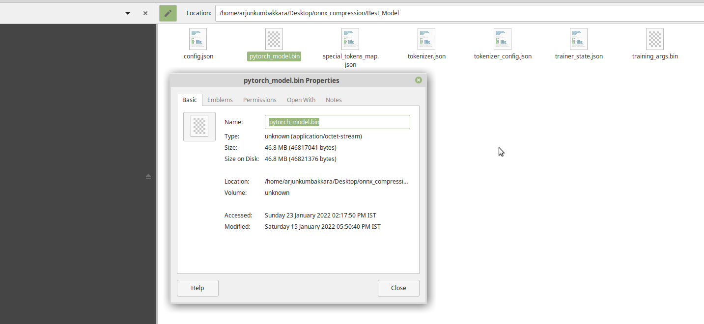
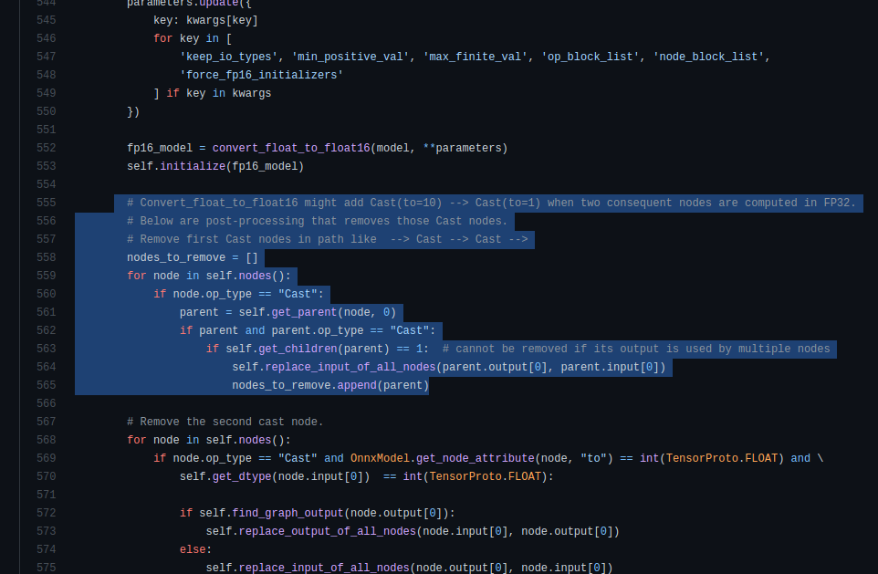
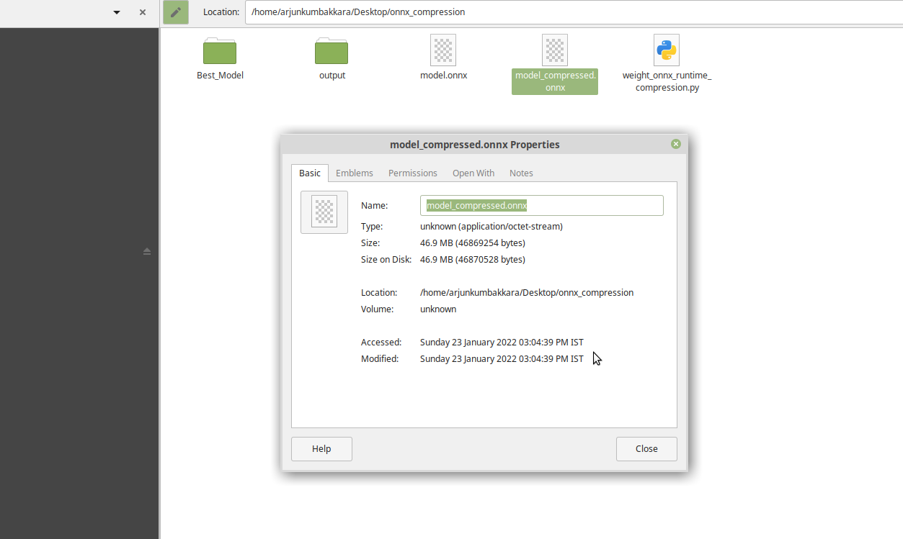
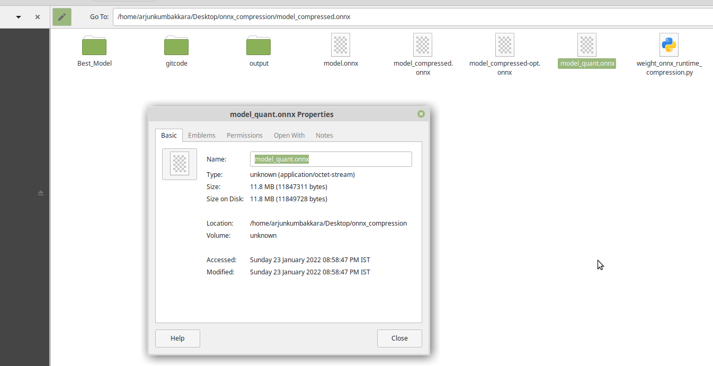

# Ways to optimize or compress your ONNX Model! 
### (without loss of mettle) 


# First : COMPRESSION :  ONNX model size compression using removal of shared layers that which can be considered duplicate. 
Just a simple pythonic way of reducing the onnx converted model. This implementation is based on a tip by the Team ONNX .

[](https://hits.seeyoufarm.com)


## Authors
## Nabarun Barua 
- [Git](https://github.com/nabarunbaruaAIML)
- [LinkedIn](https://www.linkedin.com/in/nabarun-barua-aiml-engineer/)
## Arjun Kumbakkara 
- [Git](https://github.com/arjunKumbakkara)
- [LinkedIn](https://www.linkedin.com/in/arjunkumbakkara/)

## Synopsis:

## Case: AlBERT model trained for text classification clocked at 46.8mb of size of the .bin weights file. When converted to the ONNX runtime , it became 345mb .We tried all optimizations on python before the conversion. However, the way out was to convert the .onnx converted weights to a compressed version

Original weights size:



However the  size upon conversion spiked to 340 mb.

Onnx weights size:


## Excerpt from ONNX Team on the Correctness of the solution: 
" ALBERT model has shared weights among layers as part of the optimization from BERT . 
The export  torch.onnx.export outputs the weights to different tensors as so model size becomes larger.
Using the below python Script we can remove duplication of weights, and reduce model size
ie,  Compare each pair of initializers, when they are the same, just remove one initializer, and update all reference of it to the other initializer."
#### """ONNX Team @tianleiwu"""




Post implementation : 

Compressed Onnx weights size:



Dependencies for your Reference: 


```bash
pip install --upgrade transformers sentencepiece
pip install --upgrade onnxruntime
pip install --upgrade onnxruntime-tools
```


# Second : Dynamic Quantization :  Via performing quantization on a converted ONNX model. 

Up on Dynamic Quantization 


```bash
.....
 quantize_dynamic(onnx_model_path,
                     quantized_model_path,
                     weight_type=QuantType.QInt8)......

```
Here, onnxruntime.quantization.quantize to apply quantization on the HuggingFace BERT model. It supports dynamic quantization with IntegerOps and static quantization with QLinearOps. For activation ONNXRuntime supports only uint8 format for now, and for weight ONNXRuntime supports both int8 and uint8 format.Here we are using dynamic quantization for BERT model (Albert...etc too) and use int8 for weights.





# Thirdly: by Optimizer from ONNX Runtime .
### However this is not recommended because , the num_heads,hidden_size if not chosen correctly can hamper the trained model.However , its straight forward to use .


```bash
.....
# optimize transformer-based models with onnxruntime-tools
from onnxruntime_tools import optimizer
from onnxruntime_tools.transformers.onnx_model_bert import BertOptimizationOptions
# disable embedding layer norm optimization for better model size reduction
opt_options = BertOptimizationOptions('bert')
opt_options.enable_embed_layer_norm = False
opt_model = optimizer.optimize_model(
    'bert.onnx',
    'bert', 
    num_heads=12,
    hidden_size=768,
    optimization_options=opt_options)
opt_model.save_model_to_file('bert.opt.onnx')

```


This could give you a lot of warnings as  'onnxruntime_tools ' is deprecated now .Thuw we recommend that you use the First method which is the best easiest and works like a charm.
P.S: We tested these for any unwanted deviations. Turns out theres none and it works perfectly.


