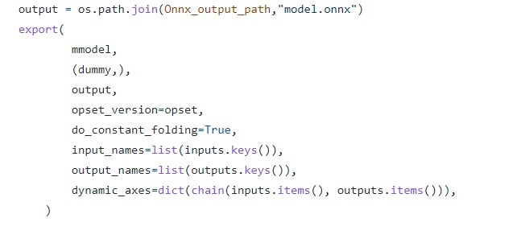
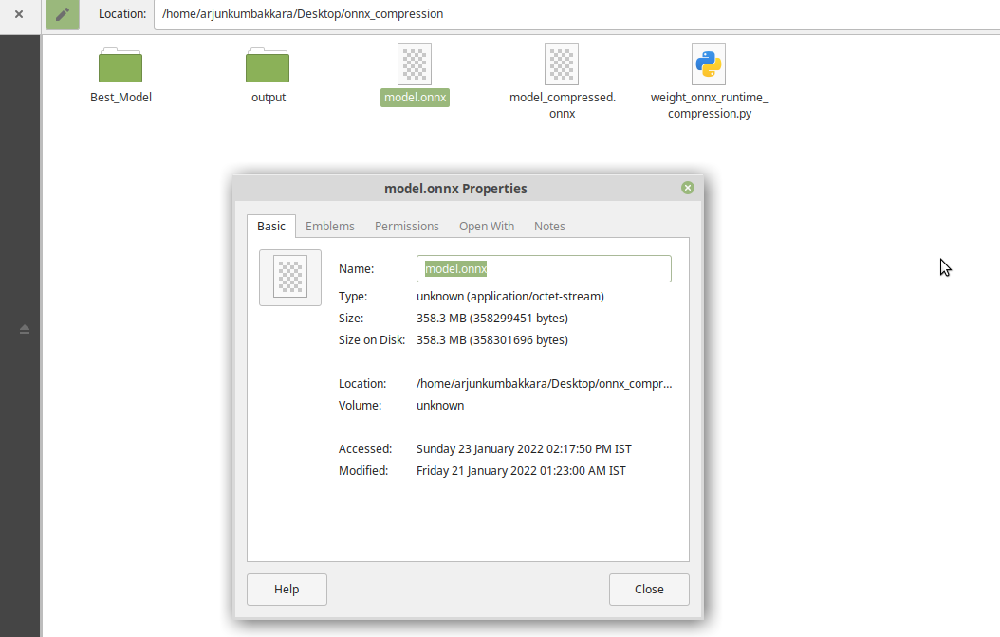

#  Convert your bulky Transformer models into lightweight high performance ONNX models!

[](https://hits.seeyoufarm.com)


## Authors
## Nabarun Barua 
- [Git](https://github.com/nabarunbaruaAIML)
- [LinkedIn](https://www.linkedin.com/in/nabarun-barua-aiml-engineer/)
## Arjun Kumbakkara 
- [Git](https://github.com/arjunKumbakkara)
- [LinkedIn](https://www.linkedin.com/in/arjunkumbakkara/)


## Synopsis:
## How we converted our ALBERT model trained for text classification to ONNX runtime and how it suddenly increased to 358.3mb from 46.8mb of size( .bin weights file).
We tried all optimizations on python before the conversion. However, the way out was to convert the .onnx converted weights to a compressed, quantized version .Details of which are laid out below:


## Why ONNX ? 
1. ONNX Runtime: cross-platform  : Since ONNX serves as a common format for all the prevalent machine learning, ai models .It becomes more of a defacto
standard to convert your trained models(weights) into ONNX compliant ONNX models.For instance, to convert any model built in Tensorflow or Pytorch intially to 
another format is a painful task.There arises a lot of unprecedented issues and exceptions, resolving which could eat up your development/Experiment time .Hence, Its the best way of making sure that your model does not get into a framework lock.
Cross-platform compliance makes it easy for deployment which we will discuss in the coming sections

2. Faster Inference : The inference is faster in the ONNX runtime as the runtime itself is built in C and as its the closest we can get to the machine .Its really fast in execution.
3. Env agnostic deployment : Although , your training stage would be in python , ONNX now gives the flexibility to deploy your trained weights into multiple other stacks or 
 enviroments such as  C#/C++/Java etc.  

In essence , ONNX helps achieve high degree of Interoperability between architectures and  hardwares. 


## Conversion to ONNX: 

As can be seen below , conversion to ONNX runtime is a matter calling an API (HuggingFace)



For further understanding ,feel free to sail over to this training pipeline built by us and check out the ONNX stage from it.
Click [ONNX](https://github.com/arjunkumbakkara/CML_with_DVC_on_Transformer_NLP/blob/main/src/stage_04_onnx.py)
[Note:If you want to understand the entire flow, then head over to this post which has the entire training pipeline explained with code and architecture. ](https://medium.com/@arjunkumbakkara/continuous-machine-learning-on-huggingface-transformer-with-dvc-including-weights-biases-1bc4520d210)


## The Catch: 
The catch here could however be that a straight up conversion might spike the overall size of your model as can be seen in the images attached below (We have used ALBERT Transformer as an example)
Post training of the model , the size obtained was 46.8mb , But after a straight conversion to ONNX runtime as described in the above section the size  increased 40x 
which is way too much for any inferencing activity. 
Thus , we had to undertake few work arounds which are explained below for your easier transition into ONNX runtimes and its effective use.


## Ways to optimize the conversion without the loss of any mettle!

# First : COMPRESSION :  ONNX model size compression using removal of shared layers that which can be considered duplicate. 
Just a simple pythonic way of reducing the onnx converted model. This implementation is based on a tip by the Team ONNX .


Original weights size:


However the  size upon conversion spiked to 358.3 mb.

Onnx weights size:



## Excerpt from ONNX Team on the Correctness of the solution: 
" ALBERT model has shared weights among layers as part of the optimization from BERT . 
The export  torch.onnx.export outputs the weights to different tensors as so model size becomes larger.
Using the below python Script we can remove duplication of weights, and reduce model size
ie,  Compare each pair of initializers, when they are the same, just remove one initializer, and update all reference of it to the other initializer."
#### """ONNX Team @tianleiwu"""


Post implementation : 

Compressed Onnx weights size:


Dependencies for your Reference: 


```bash
pip install --upgrade transformers sentencepiece
pip install --upgrade onnxruntime
pip install --upgrade onnxruntime-tools
```


# Second : Dynamic Quantization :  Via performing quantization on a converted ONNX model. 

Up on Dynamic Quantization 


```bash
.....
 quantize_dynamic(onnx_model_path,
                     quantized_model_path,
                     weight_type=QuantType.QInt8)......

```
Here, onnxruntime.quantization.quantize to apply quantization on the HuggingFace BERT model. It supports dynamic quantization with IntegerOps and static quantization with QLinearOps. For activation ONNXRuntime supports only uint8 format for now, and for weight ONNXRuntime supports both int8 and uint8 format.Here we are using dynamic quantization for BERT model (Albert...etc too) and use int8 for weights.


# Thirdly: by Optimizer from ONNX Runtime .
### However this is not recommended because , the num_heads,hidden_size if not chosen correctly can hamper the trained model.However , its straight forward to use .


```bash
.....
# optimize transformer-based models with onnxruntime-tools
from onnxruntime_tools import optimizer
from onnxruntime_tools.transformers.onnx_model_bert import BertOptimizationOptions
# disable embedding layer norm optimization for better model size reduction
opt_options = BertOptimizationOptions('bert')
opt_options.enable_embed_layer_norm = False
opt_model = optimizer.optimize_model(
    'bert.onnx',
    'bert', 
    num_heads=12,
    hidden_size=768,
    optimization_options=opt_options)
opt_model.save_model_to_file('bert.opt.onnx')

```


This could give you a lot of warnings as  'onnxruntime_tools ' is deprecated now .Thus we recommend that you use the First method which is the best easiest and works like a charm! 
P.S: We tested these for any unwanted deviations. Turns out theres none and it works perfectly.


If you like this Blog please show your love and give us a thumbs up , star us and if not please do give us a feedback in the comment section. Here’s hoping that this helped you understand the importance of Accelerated inferencing.
 
For Collaboration , Help and Learning things together -
Join our Discord Server : https://discord.gg/Z7Kx96CYGJ
GodSpeed!


